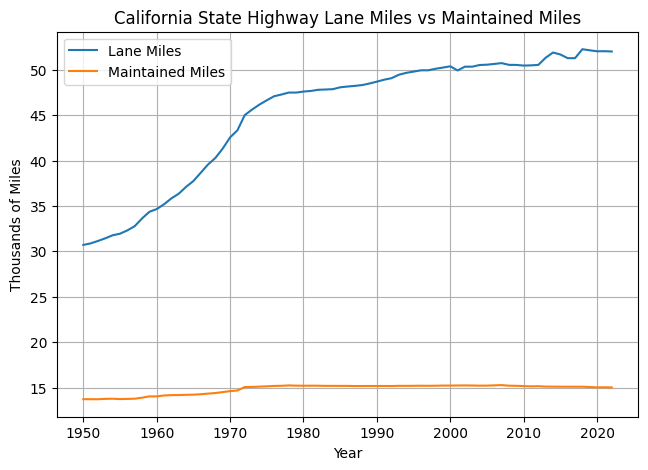

# Transportation Induced Demand Research

Understanding previous research on induced demand for traffic, there may exist some sort of novelty bias. We assert that previous studies report VMT from only state-owned roads, which may be an inaccurate representative measure countywide. Movement from undetectorized roads owned by local or federal governments may be unaccounted for.

Analyzing factors of induced demand via data sources from Caltrans PeMS, [Caltrans Public Road Data (PRD)](https://dot.ca.gov/programs/research-innovation-system-information/highway-performance-monitoring-system), historical editions of Caltrans "Assembly of statistical reports" from 1978-2000, and many other county-level demographic metrics.

<!--  -->

For the [Caltrans Public Road Data (PRD)](https://dot.ca.gov/programs/research-innovation-system-information/highway-performance-monitoring-system) have information of traffic data for the years 2000 to 2022. 

Challenges:
- There is no clear way to find expansion of lane miles in public roads that date back historically, especially on the county level.
<!-- - Are lane miles the driver of the increase of VMT? During the economic surge between the 50s to the 90s, the population and average income increased alongside VMT.  -->
